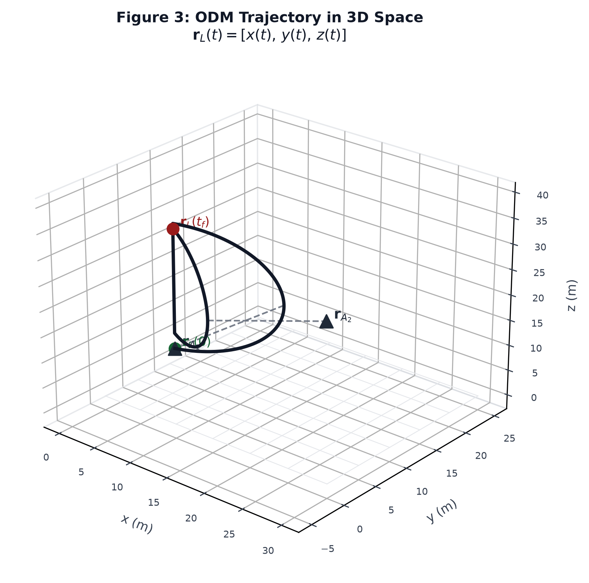
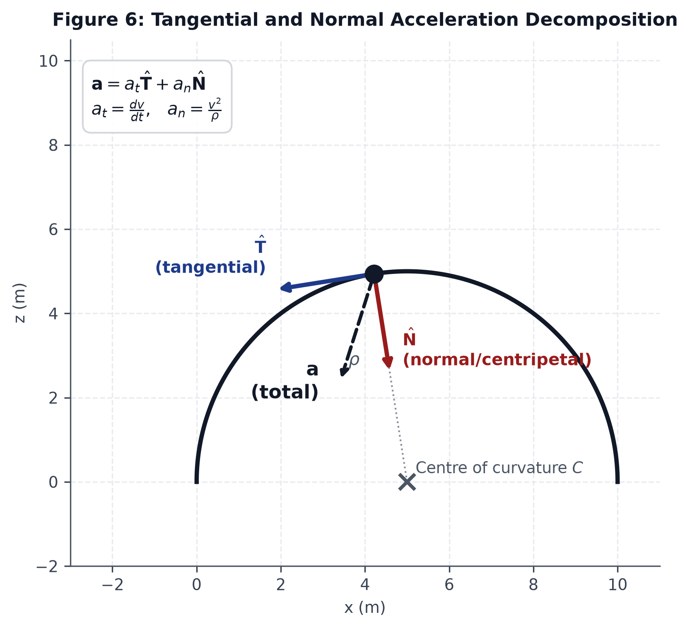
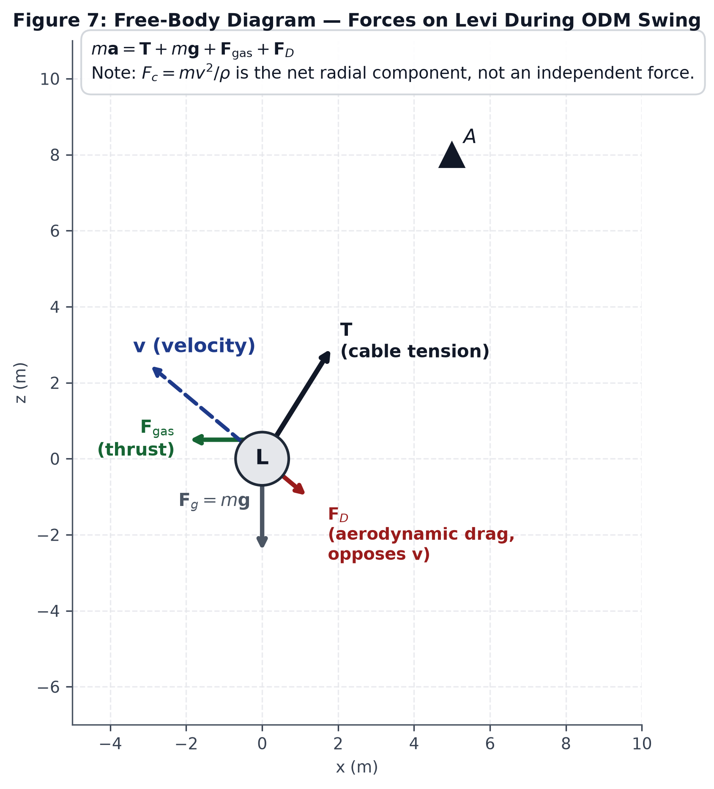
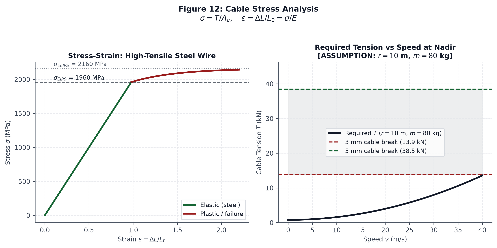
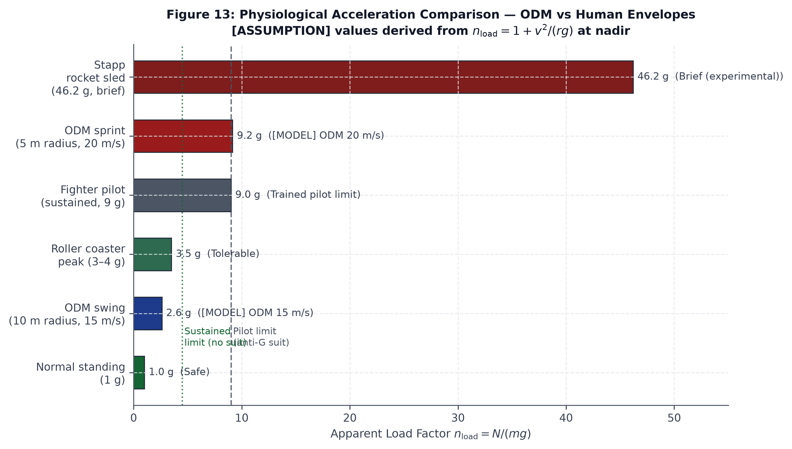

<div align="center">



# The Mathematics and Physics of ODM Gear
### A Physical Model of Levi Ackerman's Three-Dimensional Movement

[](ODM_Gear_Physics_Levi_Ackerman.pdf)
[](https://www.python.org/)
[](https://www.reportlab.com/)
[](https://matplotlib.org/)
[](LICENSE)

*Physics · Vector Mechanics · Aerodynamics · Material Science · Biomechanics · 2026*

</div>

---

## 🎯 What Is This?

This repository contains a **15-page, publication-quality academic physics essay** that applies serious Newtonian mechanics, vector dynamics, aerodynamics, material science, and human physiology to the ODM (Omni-Directional Mobility) gear used by Levi Ackerman in *Attack on Titan*.

Stylistically aligned with competition-level academic physics essays (such as the Gojo Satoru "Infinity" mechanics reference), the paper adopts a **clean white academic page aesthetic** paired with **monochrome manga ink illustrations** and **minimalist publication diagrams**, harmonizing high-level theoretical physics with canonical narrative evidence.

This is **not** a casual "anime science" article. It is a mathematically structured essay modelled on competition-level academic physics writing — with rigorous equations typeset via a dedicated Matplotlib STIX LaTeX math engine at 600 DPI, numbered theorems, proper uncertainty analysis, engineering data tables, and a comprehensive citation list of **real published sources** (no fabricated DOIs, no fan-wiki authority).

### The Central Mathematical Question

> *Can Levi Ackerman's three-dimensional ODM movement be represented as a physically meaningful constrained dynamical system, and what do mathematics and Newtonian mechanics predict about speed, acceleration, cable tension, energy, trajectory geometry, and human survivability?*

The answer hinges on a single constraint equation:

$$\|\mathbf{r}_L(t) - \mathbf{r}_A(t)\| = L(t)$$

— where $\mathbf{r}_L(t)$ is Levi's position, $\mathbf{r}_A(t)$ is the anchor position, and $L(t)$ is the instantaneous cable length. From this one equation, the entire mechanical model cascades outward.

---

## 📐 Paper Structure (14 Sections)

| Section | Title | Key Mathematics & Physics |
|---------|-------|---------------------------|
| — | **Abstract** | Central research question, constrained dynamical model |
| 1 | **Introduction** | Opening hook (Ep. 22), geometric distance constraint |
| 2 | **What Is ODM Gear?** | Component taxonomy table, dual-cable architecture |
| 3 | **Kinematics** | $\mathbf{r}(t)$, $\mathbf{v}(t)$, $\mathbf{a}(t)$ in 3D; Levi's mass ($m = 65\,\text{kg} + 15\,\text{kg} = 80\,\text{kg}$) |
| 4 | **The Cable as a Mathematical Constraint** | $\|\mathbf{r}_L - \mathbf{r}_A\| = L(t)$; holonomic velocity constraint |
| 5 | **Why Straight-Line Kinematics Fails** | Tangential–normal Frenet-Serret decomposition; $a_n = v^2/\rho$ |
| 6 | **Centripetal Force and Cable Tension** | $F_{\text{net},r} = mv^2/\rho$; vector balance $m\mathbf{a} = \mathbf{T} + m\mathbf{g} + \mathbf{F}_\text{gas} + \mathbf{F}_D$ |
| 7 | **Two-Anchor Vector Control** | $\mathbf{T}_\text{res} = \mathbf{T}_1 + \mathbf{T}_2$; manoeuvre capability table |
| 8 | **Variable Cable Length, Energy & Momentum** | Reeling power $P = T\|\dot{L}\|$; work-energy theorem; impulse $\Delta\mathbf{p} = \int \mathbf{F}\,dt$ |
| 9 | **Drag and High-Speed Limits** | $F_D = \frac{1}{2}C_D\rho A v^2$; cubic power barrier $P_D = F_D v$ |
| 10 | **Levi's Rotational Combat** | $\mathbf{L} = \mathbf{r} \times m\mathbf{v}$; angular momentum conservation during cable reel-in |
| 11 | **Could the Cables Survive?** | $\sigma = T/A_c$; wire rope mechanics; 4 mm EEIPS steel analysis |
| 12 | **Can the Human Body Survive It?** | Apparent load factor $n_{\text{load}} = 1 + v^2/(rg)$ vs normal accel $a_n/g$; NASA/Stapp envelopes |
| 13 | **Optimal Trajectory & Reality Check** | Constrained optimal control $\min \int P\,dt$; definitive reality check matrix |
| 14 | **Conclusion** | What real physics explains; what fictional worldbuilding bridges |
| — | **References** | 12 real published sources; research audit statement |

---

## 🖼️ Scientific Diagrams

All 12 figures are original — computed from physics equations and rendered with Matplotlib. No figures are borrowed from external sources.

| Figure | Description |
|--------|-------------|
| `fig03_3d_trajectory.png` | Two-anchor ODM trajectory in 3D space |
| `fig03_odm_schematic.png` | ODM gear component schematic |
| `fig05_cable_constraint.png` | Cable constraint geometry — sphere of radius L(t) |
| `fig06_tangential_normal.png` | Tangential–normal acceleration decomposition |
| `fig07_free_body.png` | Free-body diagram: **T**, **F**_g, **F**_gas, **F**_D |
| `fig08_two_anchor.png` | Two-anchor vector resultant **T**_res |
| `fig09_energy_momentum.png` | Kinetic energy vs speed; impulsive force vs time |
| `fig10_drag_force.png` | Drag force and drag power vs speed |
| `fig11_rotational.png` | Simple pendulum vs rotational attack trajectory |
| `fig12_cable_stress.png` | Stress–strain curve; cable tension vs breaking load |
| `fig13_gforce.png` | G-force comparison (ODM vs real-world references) |
| `fig14_optimization.png` | Candidate trajectories; power budget ∫P dt |

<div align="center">

| Diagram Gallery |
|---|
|   |
|   |

</div>

---

## 🏷️ Epistemic Labelling System

Every factual claim in the paper is tagged inline with one of the following markers — this is the most important design decision of the essay:

| Tag | Meaning |
|-----|---------|
| `[CANON]` | Established by the *Attack on Titan* series or official guidebooks |
| `[PHYSICS]` | Standard textbook result, independently verified |
| `[MODEL]` | Physical interpretation introduced by this paper |
| `[ASSUMPTION]` | Engineering input with explicit value, units, and sensitivity note |
| `[ESTIMATE]` | Order-of-magnitude derivation from canonical geometry |
| `[FICTIONAL LIMIT]` | Point where real physics breaks down; fictional technology required |

**No canon claim was sourced from fan wikis alone. No assumption was presented as measured fact.**

---

## 📊 Key Numerical Results

| Calculation | Formula | Result |
|-------------|---------|--------|
| Speed at bottom of 15 m swing (60° release) | $v = \sqrt{2gL(1-\cos\theta_0)}$ | **≈ 12.1 m/s** |
| Cable tension (v = 15 m/s, r = 12 m, m = 80 kg) | $T = m(v^2/r + g)$ | **≈ 2.3 kN** |
| Cable tension (v = 20 m/s, r = 8 m) | Same formula | **≈ 4.8 kN** |
| Normal acceleration (v = 15 m/s, ρ = 12 m) | $a_n = v^2/\rho$ | **≈ 18.75 m/s²** |
| Kinetic energy at v = 20 m/s | $K = \frac{1}{2}mv^2$ | **16 kJ** |
| Drag force (v = 20 m/s, horizontal) | $F_D = \frac{1}{2}C_D\rho A v^2$ | **≈ 69 N** |
| Spin speed-up (r₁ = 4 m → r₂ = 2 m) | Angular momentum conservation | **v: 10 → 20 m/s** |
| Required cable diameter (SF = 5) | $d = \sqrt{4A_c/\pi}$ | **≈ 3.9 mm** |
| G-force (v = 20 m/s, r = 10 m) | $n = v^2/(rg) + 1$ | **≈ 5.1 Gz** |
| G-force (v = 30 m/s, r = 5 m) | Same formula | **≈ 19.4 Gz ⚠️** |

---

## 🚀 Reproducing the PDF

### 1. Clone the repository

```bash
git clone https://github.com/StrangerLooter/levi-ackerman-physics.git
cd levi-ackerman-physics
```

### 2. Install dependencies

```bash
pip install -r requirements.txt
```

> **Python ≥ 3.10** required. Tested on Python 3.13.

### 3. Generate the scientific diagrams (300 DPI)

```bash
python generate_diagrams.py
```

This generates all 12 publication-ready PNG figures in `diagrams/`.

### 4. Compile the PDF paper

```bash
python generate_pdf.py
```

This compiles `output/ODM_Gear_Physics_Levi_Ackerman.pdf` (8.3 MB, 15 pages) and mirrors it to the repository root. All equations are automatically rendered to high-resolution STIX MathText assets in `rendered_equations/` and cached for fast incremental builds.

### 5. Run the Forensic Quality Assurance Audit

```bash
python qa_pdf.py
```

The automated audit script performs:
- Text extraction and completeness verification for all 14 sections
- Character-level scan for missing glyphs (`■`) or replacement characters (`\ufffd`)
- High-resolution (150 DPI) page-by-page rasterization into `output/preview/`
- Contact sheet assembly (`output/contact_sheet.png`) for visual inspection

---

## 📁 Repository Structure

```
levi-ackerman-physics/
│
├── ODM_Gear_Physics_Levi_Ackerman.pdf   ← Final publication PDF (15 pages, 8.3 MB)
│
├── math_renderer.py                     ← STIX MathText LaTeX rendering engine (600 DPI)
├── generate_diagrams.py                 ← Matplotlib script — 12 scientific figures (300 DPI)
├── generate_pdf.py                      ← ReportLab script — document assembly & layout
├── qa_pdf.py                            ← PyMuPDF forensic quality audit & contact sheet
├── requirements.txt                     ← Project dependencies
│
├── assets/                              ← Canon artwork & scene references
│   ├── cover_levi_odm.jpg
│   ├── levi_3d_coordinates.jpg
│   ├── levi_two_anchors.jpg
│   ├── levi_rotational_attack.jpg
│   └── levi_open_space.jpg
│
├── diagrams/                            ← 12 generated scientific figures
│   ├── fig03_3d_trajectory.png
│   ├── fig03_odm_schematic.png
│   ├── fig05_cable_constraint.png
│   ├── fig06_tangential_normal.png
│   ├── fig07_free_body.png
│   ├── fig08_two_anchor.png
│   ├── fig09_energy_momentum.png
│   ├── fig10_drag_force.png
│   ├── fig11_rotational.png
│   ├── fig12_cable_stress.png
│   ├── fig13_gforce.png
│   └── fig14_optimization.png
│
├── rendered_equations/                  ← Cached LaTeX equation flowable assets
├── output/
│   ├── ODM_Gear_Physics_Levi_Ackerman.pdf
│   ├── contact_sheet.png                ← 15-page visual contact sheet
│   └── preview/                         ← Page 01-15 raster previews
│
└── README.md                            ← Project documentation
```

---

## 📚 References

The paper cites 12 real, published sources:

1. Young & Freedman — *University Physics with Modern Physics*, 14th ed., Pearson, 2016
2. OpenStax — *University Physics, Volume 1*, 2016 [CC-BY 4.0]
3. Meriam & Kraige — *Engineering Mechanics: Dynamics*, 8th ed., Wiley, 2016
4. Hajime Isayama — *Attack on Titan*, Vols. 1–34, Kodansha, 2009–2021 *(primary canon source)*
5. *Attack on Titan Official Guidebook / Inside*, Kodansha, 2014 *(Levi's stats: 160 cm, 65 kg)*
6. Wire Rope Technical Board — *Wire Rope Users Manual*, 4th ed., 2005
7. Sheldahl & Klimas — *Aerodynamic Characteristics of Seven Symmetrical Airfoil Sections*, SAND80-2114, Sandia NL, 1981
8. **NASA-STD-3001** — *NASA Space Flight Human-System Standard, Vol. 1: Crew Health*, 2014
9. J.P. Stapp — "Human Tolerance to Deceleration," *Journal of Aviation Medicine*, vol. 22, 1951
10. F.E. Guignard — "Human Tolerance to Whole-Body Acceleration," *Human Factors in Aviation*, Academic Press, 1988
11. Koei Tecmo / Omega Force — *Attack on Titan: Wings of Freedom*, 2016
12. Attack on Titan Wiki — Secondary cross-reference only; not used as primary source for any physics claim

---

## 🧠 Design Philosophy

This paper was designed around five principles drawn from serious academic physics writing:

1. **Progressive escalation** — Each mathematical framework is introduced precisely when the previous one fails. The paper never introduces complexity for its own sake.

2. **Honest modelling** — Every unknown is stated explicitly. No engineering value was invented and presented as measured canon data.

3. **Epistemic rigour** — The `[CANON] / [MODEL] / [ASSUMPTION] / [ESTIMATE] / [FICTIONAL LIMIT]` tagging system ensures the reader always knows exactly what is being claimed and on what authority.

4. **Accessible depth** — The mathematics starts at A-level / first-year university physics and escalates to graduate-level constrained optimisation. Each step is legible independently.

5. **Visual quality** — All figures are purpose-built from the physics equations. No stock imagery, no copied diagrams.

---

## ⚠️ Disclaimer

This is a **fan-made, non-commercial academic exercise**. *Attack on Titan* and all related characters, gear, and lore are the intellectual property of Hajime Isayama and Kodansha. This project is not affiliated with or endorsed by any rights holder.

The physical model developed here is an original engineering interpretation, not an official description of how ODM gear is intended to work within the fictional universe.

---

## 📄 License

This project is licensed under the **MIT License** — see the [LICENSE](LICENSE) file for details.

The PDF essay and all generated figures are released under the same license. Attribution appreciated but not required.

---

<div align="center">

*"The only time a soldier should retreat is when they can't win."*
— **Levi Ackerman**

*The mathematics agrees: at n ≈ 9 Gz, retreat is the physically correct choice.*

</div>
